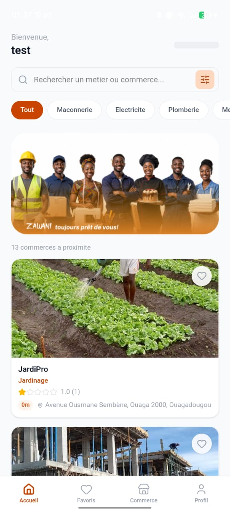
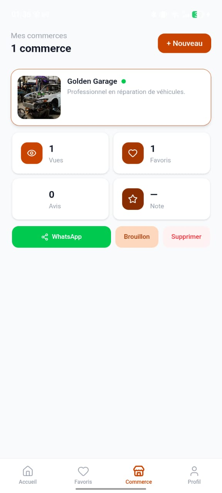
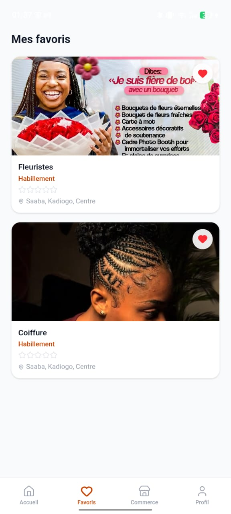
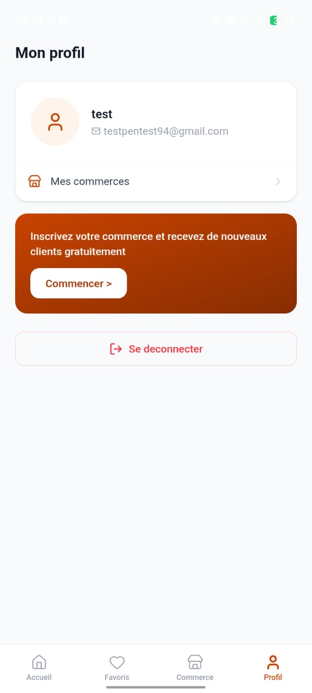
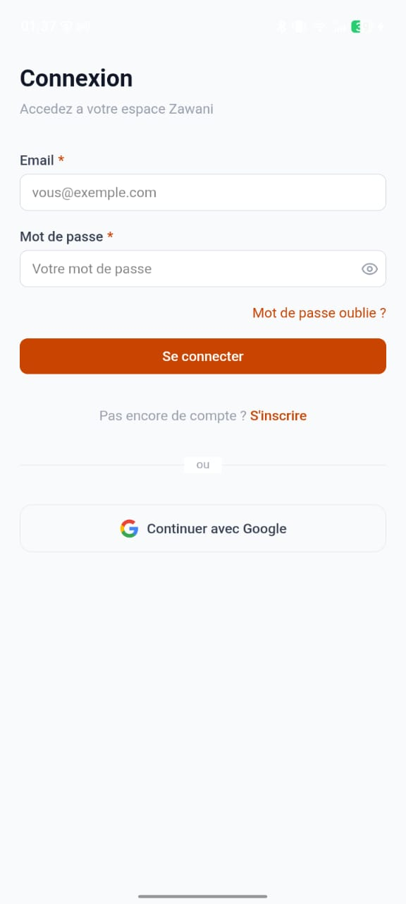
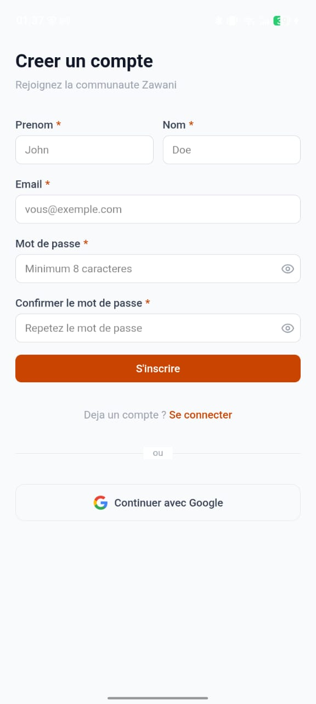

<p align="center">
  
  
</p>

<h1 align="center">ZAWANI</h1>

<p align="center">
  <strong>Application mobile d'annuaire intelligent pour commerces locaux</strong>
  <br>
  Decouvrez, geolocalisez et interagissez avec les commerces de proximite.
</p>

---

## Apercu

<p align="center">
  
  
  
  
  
  
  
</p>

## Fonctionnalites

- **Authentification** Firebase (Google, email, anonyme)
- **Geolocalisation** des commerces avec tri par distance
- **Recherche et filtre** par categorie
- **Fiche commerce** detaillee avec photos, horaires, contact
- **Notation intelligente** des commentaires par analyse semantique
- **Favoris** avec synchronisation compte
- **Creation et gestion** de commerces (brouillon / publication)
- **Dashboard** de statistiques (vues, favoris, avis, note)
- **Partage** localisation via WhatsApp
- **Mode hors-ligne** partiel grace au stockage local

## Stack technique

### Backend

| Technologie | Role |
|---|---|
| Python 3.11 + Flask 3.1 | Framework web REST |
| SQLAlchemy | ORM |
| Flask-Migrate (Alembic) | Migrations de base de donnees |
| Flask-JWT-Extended | Authentification par tokens JWT |
| Flask-Cors | Gestion du CORS |
| Marshmallow | Validation et serialisation |
| PostgreSQL 15 | Base de donnees relationnelle |
| Flasgger (Swagger) | Documentation interactive des API |
| Google Generative AI | Analyse automatique des avis |

### Frontend

| Technologie | Role |
|---|---|
| React 19 | Bibliotheque UI |
| Vite 8 | Build tool et serveur de dev |
| React Router DOM 7 | Routage SPA |
| Tailwind CSS v4 | Styling utilitaire |
| Framer Motion 12 | Animations |
| Lucide React | Icones |
| Capacitor 7 | Pont natif pour Android (APK) |
| Firebase JS SDK | Authentification (Google, email) |

### Infrastructure

| Outil | Role |
|---|---|
| Docker + Docker Compose | Conteneurisation DB et backend |
| Render | Deploiement backend |
| Firebase Auth | Fournisseur d'identite |

## Demarrage rapide

### Prerequis

- Docker et Docker Compose
- Node.js >= 18
- Python 3.11+
- Android Studio (optionnel, pour build APK)

### Backend

```bash
git clone <url-du-depot>
cd zawani
docker compose up -d
```

### Frontend

```bash
cd frontend
npm install
npm run dev
```

### Application mobile (Android)

```bash
cd frontend
npm run build
npx cap sync android
cd android
./gradlew assembleDebug
adb install app/build/outputs/apk/debug/app-debug.apk
```

## Collaborateurs

| GitHub | Nom |
|---|---|
| @PANK4SS | Pankassi Jean-Louis Rayane BICABA |
| @AllcodIn | — |
| @brecheyn | NADINGA Yiénouyaba Pharès |
| @noagthiombiano257-gif | Jeannine257 |
| @Patisilga226 | SILGA Patricia |
